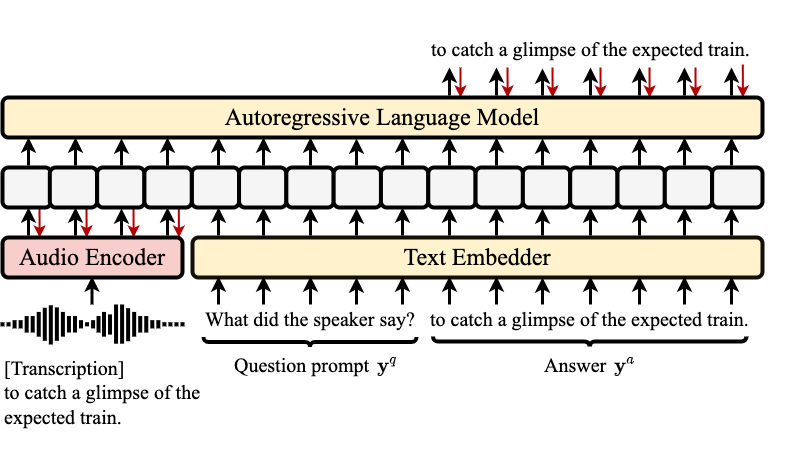

# WavPrompt
<div align="left"></div>
WavPrompt is speech understanding framework that leveraging the few-shot learning ablitiy of a large-scale pretrained language model to perform speech understanding tasks.

### Download datasets
* [LibriSpeech Corpus](https://www.openslr.org/12/)
* [Flickr8k Audio Dataset](https://groups.csail.mit.edu/sls/downloads/placesaudio/)
* [SpokenCOCO](https://groups.csail.mit.edu/sls/downloads/placesaudio/)
* [Fluent Speech Commands](https://fluent.ai/fluent-speech-commands-a-dataset-for-spoken-language-understanding-research/)
* [SLURP](https://github.com/pswietojanski/slurp)
* [ESC-50](https://github.com/karolpiczak/ESC-50)

### Prepare manifest of the dataset
Use the scripts in [wav2vec](https://github.com/pytorch/fairseq/tree/main/examples/wav2vec) repository to generate manifest files (.tsv and .ltr) for LibriSpeech.
The manifest of other datasets follows the similar format as that of the Librispeech. 
The .tsv file contains one extra column for class labels
``` text
<root directory>
<relative path> <number of frames of the audio> <class label>
<relative path> <number of frames of the audio> <class label>
```

The .ltr file contains columns for class labels, prompts and transcriptions
``` text
<class label> <prompt> <transcription>
<class label> <prompt> <transcription>
```

### Setup conda environment, fairseq and WavPrompt code:
``` bash
git clone https://github.com/Hertin/WavPrompt.git
cd WavPrompt
./setup.sh
```

### Train WavPrompt models
Train the WavPrompt models:
``` bash
cd wavprompt
rf=8 # downsampling rate
n_token=0 # if n_token is set, take the first ${n_token} features and discard the rest
freeze_finetune_updates=0 # update the wav2vec model after this number of updates
./run.sh --stage 10 --stop-stage 10 \
  --manifest-path "$(pwd)/manifest/librispeech100" --config-name "asr_pretraining" \
  --n-token ${n_token} --reduction-factor ${rf} --freeze_finetune_updates ${freeze_finetune_updates} \
  --save-dir $(pwd)/outputs/wavpromptlsp100rf${rf}ntok${n_token}
```
Or submit the training slurm job:
``` bash
sbatch train_wavprompt.slurm
```

### Evaluate the WavPrompt models
evaluate the WavPrompt model
``` bash
./eval_wavprompt.slurm bash
```
Or  submit the evaluation slurm job:
``` bash
sbatch eval_wavprompt.slurm
```
If you find this project useful, please consider citing this work.
```
@article{gao2022wavprompt,
  title={WAVPROMPT: Towards Few-Shot Spoken Language Understanding with Frozen Language Models},
  author={Gao, Heting and Ni, Junrui and Qian, Kaizhi and Zhang, Yang and Chang, Shiyu and Hasegawa-Johnson, Mark},
  journal={arXiv preprint arXiv:2203.15863},
  year={2022}
}
```
